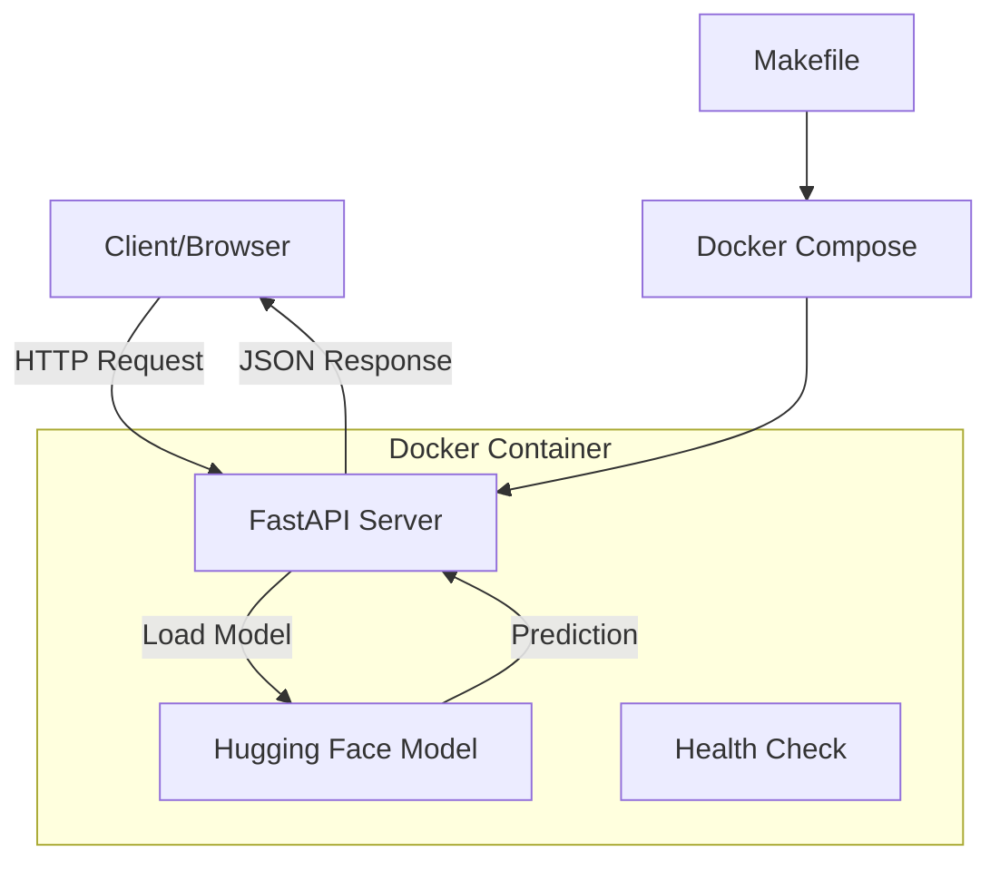
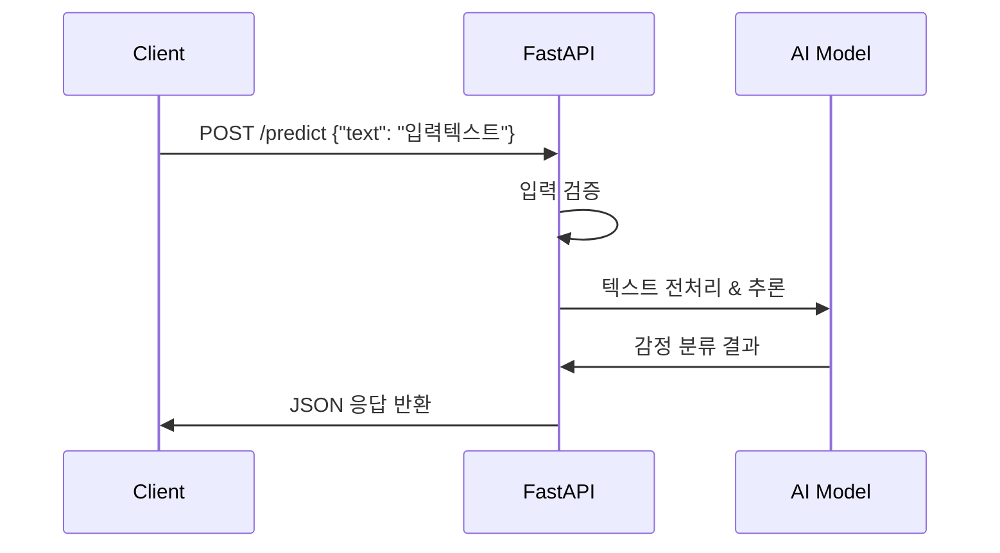

# 시스템 아키텍처

## 전체 시스템 구조



## API 엔드포인트

### 1. Health Check
- **URL**: `GET /health`
- **응답**: `{"status": "healthy", "timestamp": "2025-09-27T14:00:00Z"}`

### 2. 감정 분석
- **URL**: `POST /predict`
- **요청**:
  ```json
  {
    "text": "오늘 정말 기분이 좋다!"
  }
  ```
- **응답**:
  ```json
  {
    "sentiment": "positive",
    "confidence": 0.95,
    "processing_time": 0.12
  }
  ```

## 데이터 플로우



## 기술 스택

- **웹 프레임워크**: FastAPI
- **AI/ML**: Hugging Face Transformers, PyTorch
- **컨테이너화**: Docker, Docker Compose
- **자동화**: Makefile
- **테스트**: pytest
- **문서화**: OpenAPI/Swagger