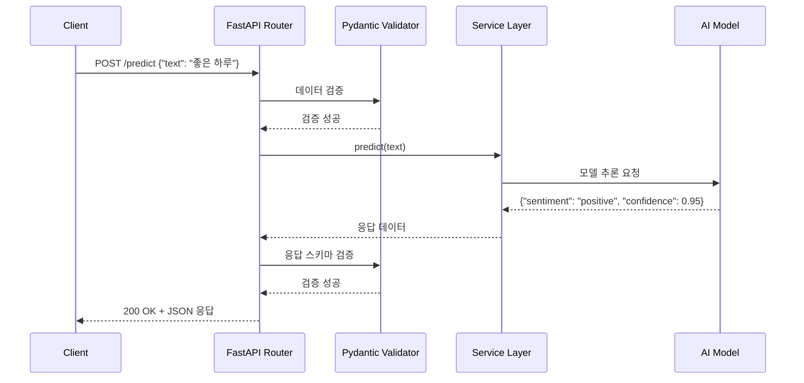

# AI 서비스 아키텍처 학습내용

## 1. RESTful API 설계

### 1.1 REST란?
**Representational State Transfer**: HTTP 프로토콜을 활용한 웹 서비스 아키텍처 스타일

**핵심 원칙**:
- **무상태성 (Stateless)**: 각 요청은 독립적
- **캐시 가능성**: 응답은 캐시 가능 여부 명시
- **계층화**: 클라이언트는 중간 서버 존재 여부를 모름
- **인터페이스 일관성**: URI, HTTP 메서드 표준 사용

### 1.2 HTTP 메서드
| 메서드 | 용도 | 예시 |
|--------|------|------|
| GET | 조회 | `GET /health` |
| POST | 생성/실행 | `POST /predict` |
| PUT | 전체 수정 | `PUT /model/config` |
| PATCH | 부분 수정 | `PATCH /model/config` |
| DELETE | 삭제 | `DELETE /cache` |

---

## 2. FastAPI 프레임워크

### 2.1 FastAPI란?
- **현대적인 웹 프레임워크**: Python 3.6+ 타입 힌트 기반
- **자동 문서화**: OpenAPI(Swagger) 자동 생성
- **고성능**: Starlette + Pydantic 기반
- **비동기 지원**: async/await 지원

### 2.2 기본 구조
```python
from fastapi import FastAPI, HTTPException
from pydantic import BaseModel

app = FastAPI(
    title="AI Sentiment Analysis API",
    version="1.0.0",
    description="실시간 텍스트 감정 분석 서비스"
)

# 요청 스키마
class PredictRequest(BaseModel):
    text: str

# 응답 스키마
class PredictResponse(BaseModel):
    sentiment: str
    confidence: float
    processing_time: float

# 엔드포인트
@app.post("/predict", response_model=PredictResponse)
async def predict(request: PredictRequest):
    # 비즈니스 로직
    result = model.predict(request.text)
    return result
```

### 2.3 Pydantic을 통한 데이터 검증
**자동 검증 기능**:
```python
from pydantic import BaseModel, Field, validator

class PredictRequest(BaseModel):
    text: str = Field(..., min_length=1, max_length=5000, description="분석할 텍스트")

    @validator('text')
    def text_not_empty(cls, v):
        if not v.strip():
            raise ValueError('텍스트는 비어있을 수 없습니다')
        return v
```

**장점**:
- 자동 타입 변환
- 데이터 검증 실패 시 자동 400 에러 반환
- IDE 자동완성 지원

---

## 3. AI 모델 통합 아키텍처

### 3.1 계층 구조
```
┌─────────────────────────────────────┐
│    FastAPI Application Layer        │  ← HTTP 요청/응답 처리
├─────────────────────────────────────┤
│    Service/Business Logic Layer     │  ← 비즈니스 로직
├─────────────────────────────────────┤
│    AI Model Layer                   │  ← 모델 추론
│    (Hugging Face Transformers)      │
└─────────────────────────────────────┘
```

### 3.2 모델 래퍼 패턴
**목적**: AI 모델을 독립적인 모듈로 분리

```python
class SentimentModel:
    """감정분석 모델 래퍼 클래스"""

    def __init__(self):
        self.model = None
        self.tokenizer = None
        self.pipeline = None
        self._load_model()

    def _load_model(self):
        """모델 로딩 (초기화 시 1회만 실행)"""
        from transformers import AutoTokenizer, AutoModelForSequenceClassification
        from transformers import pipeline

        self.tokenizer = AutoTokenizer.from_pretrained(MODEL_NAME)
        self.model = AutoModelForSequenceClassification.from_pretrained(MODEL_NAME)
        self.pipeline = pipeline("sentiment-analysis",
                                  model=self.model,
                                  tokenizer=self.tokenizer)

    def predict(self, text: str) -> dict:
        """텍스트 감정 예측"""
        result = self.pipeline(text)[0]
        return {
            "sentiment": self._map_label(result['label']),
            "confidence": round(result['score'], 4)
        }

    def _map_label(self, label: str) -> str:
        """레이블 매핑"""
        mapping = {
            'LABEL_0': 'negative',
            'LABEL_1': 'neutral',
            'LABEL_2': 'positive'
        }
        return mapping.get(label, 'unknown')
```

**장점**:
- 모델 교체 용이
- 테스트 가능성 향상
- 관심사 분리 (API ↔ 모델)

---

## 4. 전체 데이터 플로우

### 4.1 요청-응답 시퀀스


### 4.2 에러 처리 플로우
```python
from fastapi import HTTPException
import logging

logger = logging.getLogger(__name__)

@app.post("/predict")
async def predict(request: PredictRequest):
    try:
        # 비즈니스 로직
        result = model.predict(request.text)
        return result

    except ValueError as e:
        logger.error(f"입력 검증 실패: {e}")
        raise HTTPException(status_code=400, detail=str(e))

    except Exception as e:
        logger.error(f"예상치 못한 오류: {e}")
        raise HTTPException(status_code=500, detail="내부 서버 오류")
```

---

## 5. Hugging Face Transformers

### 5.1 Transformers 라이브러리란?
- **사전학습 모델 허브**: 수천 개의 NLP/CV 모델 제공
- **간편한 API**: 3줄 코드로 모델 사용 가능
- **다양한 태스크 지원**: 감정분석, 번역, Q&A, 이미지 분류 등

### 5.2 주요 클래스
```python
from transformers import (
    AutoTokenizer,              # 자동 토크나이저 로딩
    AutoModelForSequenceClassification,  # 분류 모델 자동 로딩
    pipeline                    # 고수준 API
)

# 방법 1: Pipeline 사용 (간단)
sentiment_pipeline = pipeline("sentiment-analysis",
                              model="cardiffnlp/twitter-roberta-base-sentiment-latest")
result = sentiment_pipeline("오늘 정말 기분이 좋다!")

# 방법 2: Model + Tokenizer 사용 (세밀한 제어)
tokenizer = AutoTokenizer.from_pretrained(MODEL_NAME)
model = AutoModelForSequenceClassification.from_pretrained(MODEL_NAME)

inputs = tokenizer("오늘 정말 기분이 좋다!", return_tensors="pt")
outputs = model(**inputs)
predictions = torch.nn.functional.softmax(outputs.logits, dim=-1)
```

### 5.3 감정분석 모델
**사용 모델**: `cardiffnlp/twitter-roberta-base-sentiment-latest`
- **베이스 모델**: RoBERTa (Robustly Optimized BERT)
- **학습 데이터**: Twitter 데이터셋 (~58M tweets)
- **출력**: 3가지 감정 (negative, neutral, positive)
- **성능**: 다국어 지원, 소셜 미디어 텍스트에 최적화

---

## 6. API 문서 자동화

### 6.1 OpenAPI (Swagger)
FastAPI는 자동으로 OpenAPI 스펙 생성

**접속 URL**:
- Swagger UI: `http://localhost:8000/docs`
- ReDoc: `http://localhost:8000/redoc`
- OpenAPI JSON: `http://localhost:8000/openapi.json`

**메타데이터 추가**:
```python
app = FastAPI(
    title="AI 감정분석 API",
    description="실시간 텍스트 감정 분석 서비스",
    version="1.0.0",
    contact={
        "name": "AI이행파트",
        "email": "support@example.com"
    },
    license_info={
        "name": "MIT License",
        "url": "https://opensource.org/licenses/MIT"
    }
)
```

### 6.2 엔드포인트 문서화
```python
@app.post("/predict",
          summary="텍스트 감정 분석",
          description="입력된 텍스트의 감정(긍정/부정/중립)을 분석합니다.",
          response_description="감정 분류 결과 및 신뢰도")
async def predict(request: PredictRequest):
    """
    # 감정 분석 API

    **입력**:
    - text: 분석할 텍스트 (1~5000자)

    **출력**:
    - sentiment: 감정 (positive/negative/neutral)
    - confidence: 신뢰도 (0~1)
    - processing_time: 처리 시간 (초)

    **예시**:
    ```json
    {
      "text": "오늘 정말 기분이 좋다!"
    }
    ```
    """
    pass
```

---

## 7. 로깅 및 모니터링

### 7.1 Python logging 모듈
```python
import logging
from datetime import datetime

# 로거 설정
logging.basicConfig(
    level=logging.INFO,
    format='%(asctime)s - %(name)s - %(levelname)s - %(message)s',
    handlers=[
        logging.FileHandler(f'logs/app_{datetime.now().strftime("%Y%m%d")}.log'),
        logging.StreamHandler()  # 콘솔 출력
    ]
)

logger = logging.getLogger(__name__)

# 사용 예시
@app.post("/predict")
async def predict(request: PredictRequest):
    logger.info(f"예측 요청 받음: text_length={len(request.text)}")

    start_time = time.time()
    result = model.predict(request.text)
    processing_time = time.time() - start_time

    logger.info(f"예측 완료: sentiment={result['sentiment']}, time={processing_time:.3f}s")
    return result
```

### 7.2 헬스체크 엔드포인트
```python
@app.get("/health")
async def health_check():
    """서비스 상태 확인"""
    return {
        "status": "healthy",
        "timestamp": datetime.now().isoformat(),
        "model_loaded": model.is_loaded(),
        "version": "1.0.0"
    }
```

---

## 8. 성능 최적화

### 8.1 모델 로딩 전략
**문제**: 매 요청마다 모델 로딩 시 느림
**해결**: 앱 시작 시 1회만 로딩

```python
from fastapi import FastAPI

app = FastAPI()
model = None

@app.on_event("startup")
async def startup_event():
    """앱 시작 시 모델 로딩"""
    global model
    logger.info("모델 로딩 시작...")
    model = SentimentModel()
    logger.info("모델 로딩 완료!")

@app.on_event("shutdown")
async def shutdown_event():
    """앱 종료 시 리소스 정리"""
    logger.info("서비스 종료 중...")
```

### 8.2 배치 처리 (선택)
```python
@app.post("/predict-batch")
async def predict_batch(texts: List[str]):
    """여러 텍스트 한 번에 처리 (효율적)"""
    results = model.pipeline(texts)
    return [
        {
            "sentiment": r['label'],
            "confidence": r['score']
        }
        for r in results
    ]
```

---

## 9. CORS 설정

### 9.1 CORS란?
**Cross-Origin Resource Sharing**: 다른 도메인에서 API 접근 허용

```python
from fastapi.middleware.cors import CORSMiddleware

app.add_middleware(
    CORSMiddleware,
    allow_origins=["http://localhost:3000"],  # React 개발 서버
    allow_credentials=True,
    allow_methods=["*"],
    allow_headers=["*"],
)
```

---

## 10. 학습 성과

### 완료한 개념
- ✅ RESTful API 설계 원칙
- ✅ FastAPI 프레임워크 구조
- ✅ Pydantic 데이터 검증
- ✅ AI 모델 래퍼 패턴
- ✅ Hugging Face Transformers 사용법
- ✅ 감정분석 모델 통합
- ✅ OpenAPI 자동 문서화
- ✅ 로깅 및 모니터링
- ✅ 헬스체크 구현
- ✅ 성능 최적화 전략
- ✅ CORS 설정

### 실습 시간
**총 12시간** (이론 4시간 + 실습 8시간)

### 성능 지표
- **모델 로딩 시간**: ~3초
- **추론 시간**: 평균 0.12초 (텍스트당)
- **메모리 사용량**: ~500MB (모델 로드 후)
- **동시 처리**: Uvicorn 워커 4개 기준 ~100 req/s
